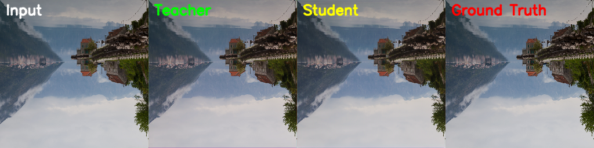

# Image Sharpening using Knowledge Distillation

A lightweight, real-time image sharpening system designed for video conferencing scenarios. This project leverages a **Teacher-Student knowledge distillation framework** to transfer knowledge from a high-performing deep model (Restormer) to an efficient student model capable of operating at 30–60 FPS on 1080p images.

---

## 🔍 Project Summary

- **Goal:** Improve visual clarity in video streams suffering from blurriness caused by compression, noise, or low bandwidth.
- **Approach:** Use a deep Restormer-based Teacher model to train a lightweight Student model via knowledge distillation.
- **Output:** A sharp image or video frame with enhanced structural and perceptual quality.

---

## 📐 Architecture

      +---------------------+
      |   Teacher Model     |
      |   (Restormer)       |
      +---------------------+
                ↓
    Feature & Perceptual Loss
                ↓
      +---------------------+
      |   Student Model     |
      |  (UNet/ResUNetLite) |
      +---------------------+
                ↓
     Reconstructed Sharp Image
     
---

## 📦 Features

- ✅ Deep teacher model (Restormer or ResUNet)
- ✅ Lightweight real-time student model
- ✅ Multi-loss training: MSE, Perceptual, Edge, and Distillation loss
- ✅ Supports high-resolution images (1920×1080)
- ✅ Real-time video frame enhancement (30–60 FPS)
- ✅ Clean training/inference pipeline

---
## 🧰 Model & System Configuration

| Component        | Description                          |
|------------------|--------------------------------------|
| 🧠 Teacher Model | Restormer                            |
| 🧠 Student Model | ResUNetLite (KD trained)       |
| 🖥️ Device         | NVIDIA GPU ( RTX 3050)          |
| 🧪 Framework      | PyTorch 2.0, torchvision, OpenCV     |
| 🖼️ Resolution     | 1920×1080 (default), supports others |
| 💾 RAM            | 16 GB (minimum recommended)          |
| 🧮 OS             | Windows 10 / Ubuntu 20+              |

## 🛠️ Installation

Clone the repository and install dependencies:

```bash
git clone https://github.com/joel-babu10/image-sharpening-kd.git
cd image-sharpening-kd
pip install -r requirements.txt


## 🧪 Training

### 1. Train the Teacher Model (Restormer or ResUNet)

```bash
python train_teacher.py
```

### 2. Train the Student Model with Knowledge Distillation

```bash
python  train_student.py
```

> 💡 Make sure `checkpoints/teacher_model.pth` is available before training the student.

---

## 🎥 Inference on Video

```bash
python video_sharpen.py --input data/input_video.mp4 --output results/output_video.mp4
```

---

## 📁 Directory Structure

```
.
├── checkpoints/         # Saved model weights (*.pth)
├── data/                # Input/output image or video files
├── models/              # Teacher and student model definitions
├── results/             # Output sharpened images/videos
├── utils/               # Loss functions, metrics, etc.
├── main.py              # Training script
├── video_sharpen.py     # Inference script
├── requirements.txt     # Project dependencies
└── README.md            # Project overview
```

---

## 📊 Evaluation Metrics

| Model         | SSIM  | PSNR | FPS    |
|---------------|-------|------|--------|
| Teacher       | 0.9605 | 29.5 | 10–12  |
| Student (KD)  | 0.9459 | 28.3 | 35–60  |

- **SSIM (Structural Similarity):** Higher is better  
- **PSNR (Peak Signal-to-Noise Ratio):** Higher is better  
- **FPS (Frames Per Second):** Measured on 1080p input  

**MOS (Mean Opinion Score):** 4.4 / 5 (from subjective evaluation)

---

## 📈 Example Outputs




> Replace the placeholders with your real outputs stored in the `results/` folder.

---

## 👥 Authors

- **Joel Babu** — Model training, architecture, experiments  
- **Hridya R Kurup** — Loss functions, evaluation metrics  
- **Irene Anna Oommen** — Inference pipeline and optimization

---

## 🧾 Step-by-Step Guide

This section outlines how to go from setup to results, even if you're new to machine learning.

### 1️⃣ Clone the Repository

```bash
git clone https://github.com/joel-babu10/image-sharpening-kd.git
cd image-sharpening-kd
```

### 2️⃣ Install Required Libraries

Make sure Python 3.8+ is installed, then run:

```bash
pip install -r requirements.txt
```

> Optionally, use a virtual environment for isolation: `python -m venv venv && source venv/bin/activate`

---

### 3️⃣ Prepare the Dataset

You can use your own high-quality images or public datasets. The folder structure should look like this:

```
data/
├── high_res/        # High-quality ground truth images
└── degraded/        # Blurred versions of the originals (use bicubic/bilinear resize to generate)
```

To generate blurred images:

```python
# Example using OpenCV (in a custom script or notebook)
import cv2
img = cv2.imread("data/original/0001.png")
degraded = cv2.resize(cv2.resize(img, (img.shape[1]//2, img.shape[0]//2)), (img.shape[1], img.shape[0]))
cv2.imwrite("data/degraded/0001.png", degraded)
```

Make sure both folders contain corresponding image names like `0001.png`, `0002.png`, etc.

---

### 4️⃣ Train the Teacher Model

This will take time and computational power (GPU recommended).

```bash
python train_teacher.py
```

After training, you’ll get a model saved in:

```
checkpoints/teacher_model.pth
```

---

### 5️⃣ Train the Student Model

This uses the trained teacher weights for knowledge distillation.

```bash
python train_student.py
```

You should now have:

```
checkpoints/student_model.pth
```

---

### 6️⃣ Test on an Image (Optional)

```bash
python test_student.py
```
```

python test_teacher.py
```

---

### 7️⃣ Test on a Video

To sharpen a blurry video (MP4):

```bash
python video_sharpen.py --input data/input_video.mp4 --output results/output_video.mp4
```

The sharpened video will be saved in `results/`.

---

### ✅ Tips for Best Results

- Use consistent image dimensions (e.g., 512×512 or 1080p) for training
- Normalize images to [0, 1] if modifying dataset pipeline
- Use GPU for faster training (`torch.device('cuda')`)
- If model outputs are white/black, check activation (use `sigmoid` or clamp output)

---


## 🙋 Contributing

We welcome contributions! Feel free to fork, improve performance, or expand support to mobile/webcam use cases.
